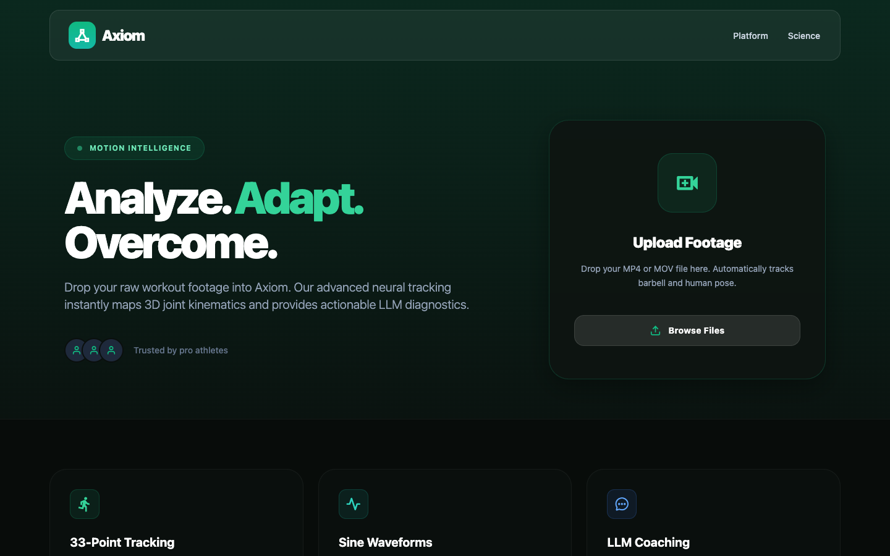

# Axiom - High-Tech Fitness Analytics Platform

Axiom is a next-generation body tracking and fitness analytics web application. By uploading training footage, our neural networks map your biomechanics in 3D, parsing your form and analyzing waveforms to generate professional-grade, semantic feedback instantly via LLMs.

## Screenshots

### Landing Page


## Tech Stack
- **Framework**: [Expo](https://expo.dev) + [React Native Web](https://necolas.github.io/react-native-web/) for cross-platform unified development
- **Routing**: `expo-router` for file-based navigation
- **Styling**: `nativewind` + `tailwindcss` for high-performance class-based styling
- **Animations & Video**: `expo-av`, `react-native-reanimated`, `react-native-svg`

## Running Local Development (Web)

To run the development server and view the project in your browser:

### 1. Install Dependencies
Make sure you are in the `frontend` directory and install the necessary npm packages:

```bash
npm install
```

### 2. Start the Development Server
Since everything is configured via Expo Webpack bounds, simply run:

```bash
npm run web
```
Wait for the Metro Bundler to compile and open `http://localhost:8080` in your web browser.

### 3. Production Export (Optional)
If you want to view the optimized production web build:

```bash
npx expo export --platform web
npx serve dist -l 8080
```
Then visit `http://localhost:8080`.

## Architecture Overview
- **`app/index.tsx`**: The main Landing Page containing the glassmorphic UI, brand elements, and video upload dropzone.
- **`app/dashboard.tsx`**: The complex interactive Performance Dashboard routing view containing the mock video player, kinematic overlays, SVG sine waveforms, and the AI Terminal output console. 
- **`src/global.css`**: Tailwind classes and global gradients layer.
- **`assets/`**: Local fonts, images, and mockup screenshots.
